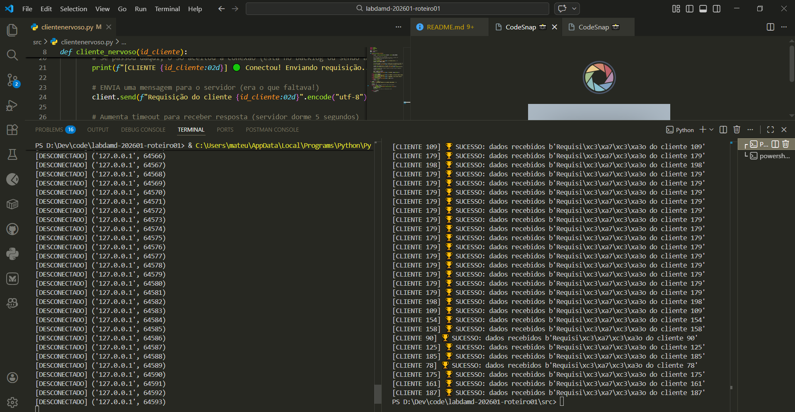

### Respostas

- **Questão 1 — Backlog e Recusa de Conexões:**
O clientenveroso.py apresentou falhas ao testar o servergargalo.py devido a listen(1), a fila é muito pequena, mesmo com os Sistemas Operacionais arredondando para cima, como ainda sobra muitos clientes considerando a quantidade que nós temos. Já no server.py o listen() não tem parâmetro passado, então utiliza a fila padrão (mais alta do que o número de clientes que temos), então quando aceita uma conexão cria uma thread e volta para o accept(), mesmo com 10 clientes (nossa quantidade) o servidor volta rápido e aceita os novos.

- **Questão 2 — Custo de Recursos: Threads vs. Event Loop:**
    Pelo que pode ser observado ao completar até a etapa 3, analisando tanto a abordagem multithread e a assíncrona, foi possível perceber que o consumo de memória e CPU é maior na multithread, porque foca na criação de thread, e cada uma tem sua própria stack, além de o SO precisar aternar entre as threads, cada troca tem seu custo de salvar e carregar nos registradores, então quanto mais threads, mais overhead. No server.py quando conectamos 10 clientes deu para ver 10 clientes e 11 threads ativas. Já no modelo assíncrono, apenas 1 thread mas com múltiplas corrotines, e são estruturas mais leves do que as threads, além de não ter troca de contexto de uma thread para outra, então o overhead da cpu é mínimo. O que mais gasta seria o wawait na troca de corrotina, mas é mais barato do que na troca de threads.

